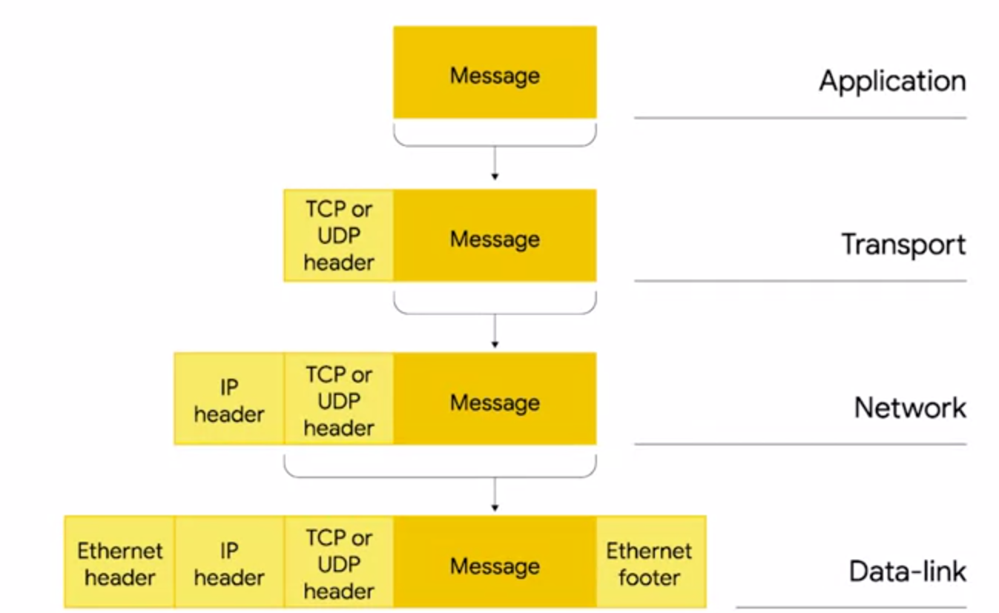
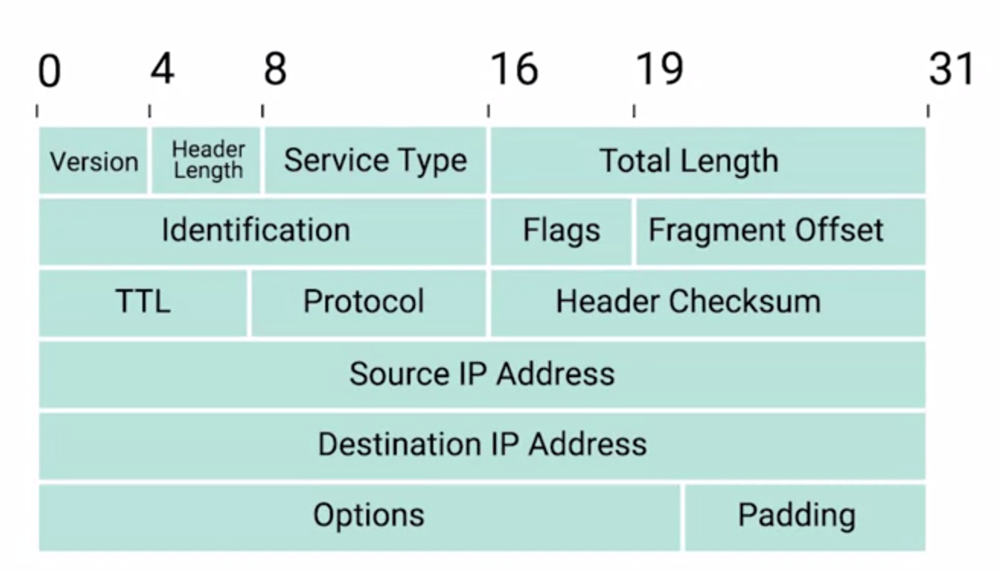

# Encapsulamento IP

- No protocolo IP os dado são chamados de datagrama IP
  - Possui uma série de campos fixos e estruturada de forma simples
- As principais estruturas do Datagram são o cabeçalho e a carga
- Todo o conteúdo de um datagrama IP é encapsulado como a carga de um quadro Ethernet

## Divisão

- Versão: Versão do protocolo que está sendo utilizado, o mais comum é o IPv4 **(4 Bits)**
- Tamanho do cabeçalho: Informa qual o comprimento completo do cabeçalho **(4 Bits)**
- Tipo de serviço: Específica sobre a qualidade de serviços ou tecnologias ou QoS **(8 Bits)**
- Comprimento total: Indica o tamanho total do datagrama IP a qual está vinculado **(16 Bits)**
- Campo de identificação: Usado para agrupar mensagens, por exemplo se os dados forem muito extensos eles terão que ser separados em pacotes que são linkados a partir do seu campo de identificação, assim o PC reconhece que todos os pacotes fazem parte de uma mesma requisição **(16 Bits)**.
- Flag e deslocamento de fragmentação: A flag é utilizada para indicar se o datagrama tem permissão para ser fragmentado ou se já foi fragmentado e a fragmentação é o que permite que os datagramas fragmentados sejam organizados novamente na forma correta **(4 Bits e 12 Bits)**
- TTL (Time to Live): Informa quantos saltos entre roteadores o datagrama pode fazer antes de ser descartado. É um contador simples, assim que chega a 0 o datagrama é descartado e não segue mais adiante **(8 Bits)**
- Protocolo: Contém informações de qual protocolo é usado na camada de transporte TCP/UTP **(8 Bits)**.
- Soma de verificação de cabeçalho: É uma soma de todo o conteúdo presente no cabeçalho funciona como o FCS do Ethernet (16 Bits)
- Endereço de IP da origem e destino **(32 Bits cada)**
- Opções do IP: Campo opcional usado para definir características especiais ao datagrama, geralmente utilizado para testes.
- Padding: Uma série de zeros para garantir que o cabeçalho tenha o tamanho correto

